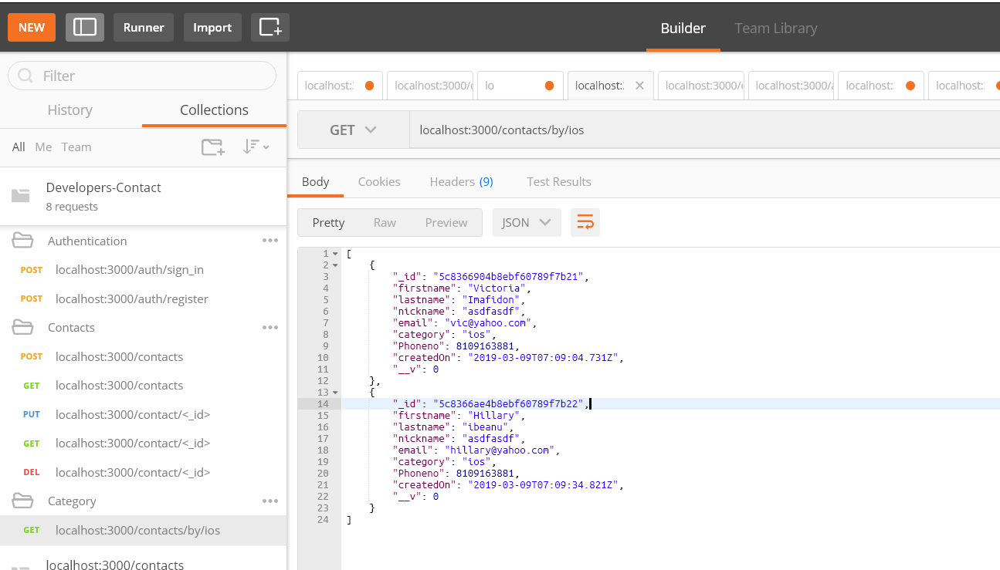
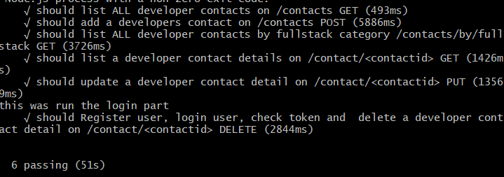

# Dev-Contact-API

* API for developers contact directory.
* The API performs CRUD operations on Developer's contact details.
* The API categorizes the developer's as either a front-end developer of backend developer and/or some other categories.
* Mocha and Chai testing frameworks used to write test cases for the contact API entry points.
* Document the entry points on POSTMAN

## To Run

* [Download the installer](https://nodejs.org/) for Node.js 6 or greater.
* Clone this repository: `https://github.com/paulappz/Dev-Contact-API.git`.
* Run `npm install` from the project root.
* To Run node API ` node server` in a terminal from the project root.
* Test on Postman 
  


## To Test

* Run `npm install -g mocha` 
* To Test `mocha` in a terminal from the project root.
  


  ## File Structure of App

```
Dev-Contact-API/
├-- .github/                            * GitHub files
│   ├── CONTRIBUTING.md                 * Documentation on contributing to this repo
│   └── ISSUE_TEMPLATE.md               * Template used to populate issues in this repo
|
|
|
|-- api/
|    |-- controllers/                   * API Controller folder
|    |    ├── authController.js         * user Auth file
|    |    └── devContactListController.js  * Contact list file
|    | 
|    |-- models/                        * API Model folder
|    |    ├── devContact.js             * contact model file
|    |    └── userModel.js              * user auth model file
|    |
|    |-- routes/                        * API route folder
|         ├── devContactRoutes.js       * API route file
|    
|-- config/
|    |-- db.js                          * Db connection file
|
|-- test/
|    |-- test-server.js                 * This is test file 
|
├── package.json                        * Defines our JavaScript dependencies
├── package-lock.json                   * ----------
├── README.md                           * This file
├── server.js                           * API server file
├── test-doc.png                        * postman test image 
├── test-result.png                     * mocha test image